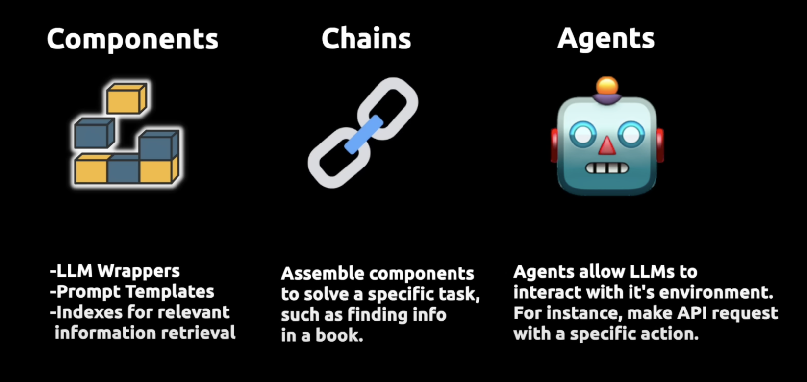

Video Link:
https://www.youtube.com/watch?v=aywZrzNaKjs&list=PPSV

Langchain makes LLMs...
- Data Aware (load context)
- Agentic (can take actions)

Use cases are infinite when this is possible:
- Learning
- Personal Assistance
- Combining LLMs and analysis with proprietary data sets

LLM Wrappers -> connect to Hugging Face, GPT, Cohere
Prompt Templates -> don't have to hard code prompts
Indexes -> relevant information retrieval

Chains -> enable us to assemble parts to build a chain of actions, a full app that does complex things

Agents -> allows LLMs to interact with its environment;

-----
python-dotevn -> manage env variables;
langcahin -> langchain library
pinecone-client -> vector store
